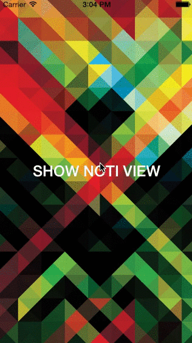
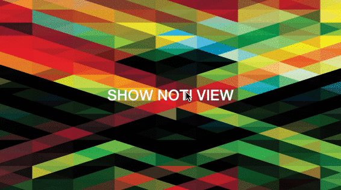

## Introduction
HDNotificationView appears notification view like system.

 

## Requirement
- iOS 9.0+

## Installation

**Carthage**
```
github "nhdang103/HDNotificationView"
```

**Manual**
- Add thress files below to your project:
   + **HDNotificationView.swift**
   + **HDNotificationData.swift**
   + **HDNotificationAppearance.swift**
   
- Add **Snapkit** as a dependence framework to your project.

## Usage


## License
HDNotificationView is available under the MIT License. See the [LICENSE](./License) for details.
